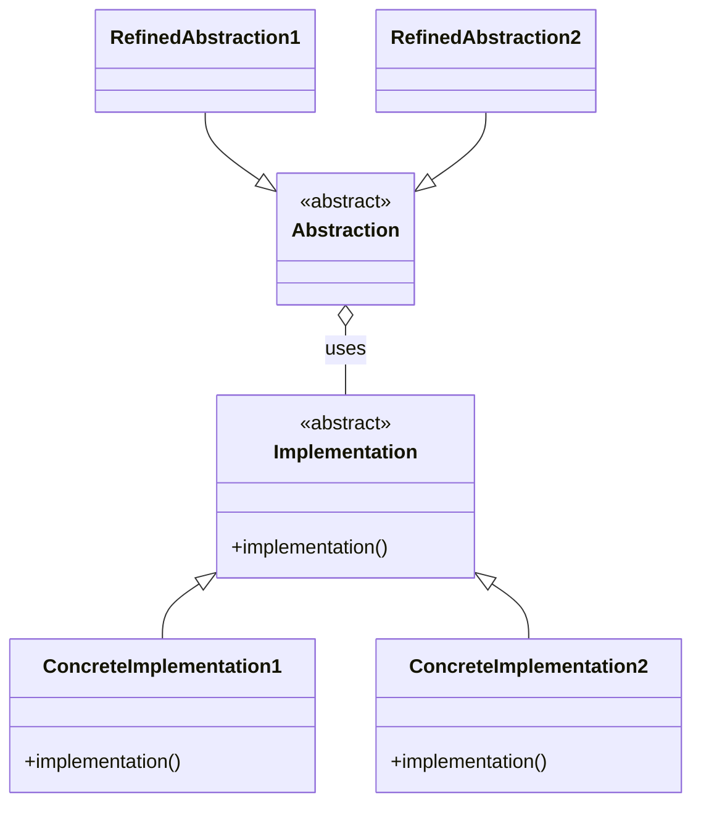
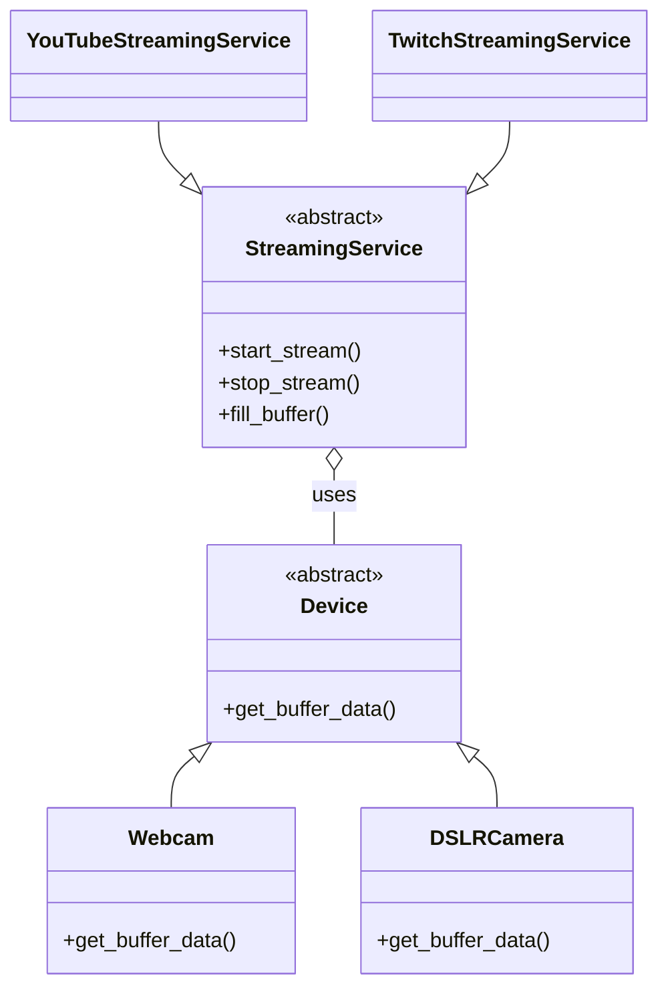

# Let's Take The Bridge Pattern To The Next Level

This video covers how the bridge pattern works and why it's useful. To spice things up, I'm going to deviate from the classic definition of the pattern from the Gang-of-four book (which is already quite powerful) and show you a couple of things you can do in Python to shorten the code and at the same time allow for extra flexibility.

Here's the link to the video: https://youtu.be/mM2-FPm1EhI.

# Class diagrams

## Original bridge pattern

## Streaming devices and services example

- App -> stream to diff services and devices link to diff services
- new stream devices without changing code to services and vice versa without modifying code
- 2 seperate hierarchies of abstraction and depedency between them - bridge schema 
- introduce new variations or subclasses independenly
- Coupling occurs at the absraction level 
- 
Abstraction Class 1 <- Subclasses1
uses 
Abstraction Class 2 <- Subclasses2
- Set using protocol
- functions
    - functions are first class citizen in python that can be passed around
    - move beyond OOP ex. Streaming Device can be just method rather than class as abstraction
    - still same 2 hierarchies with methods as 1 - decoupling using types
- abc class 
    - provide relationship between abstraction and implementation
    - inheritance relationships 
    - define list of devices and use in any of the streaming device
    - define methods / attributes at super class level that can be used at subclass level